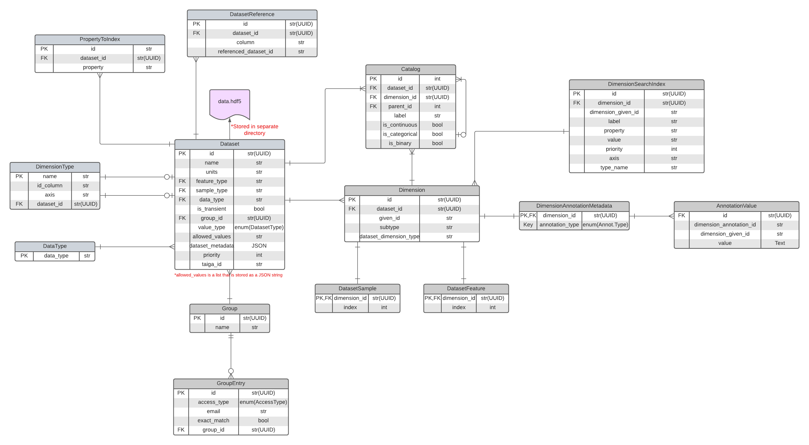

# Breadbox

Breadbox is a persistent service for storing and retrieving data for the [DepMap portal](https://github.com/broadinstitute/depmap-portal). It aims to simplify and consolidate formats across datasets that are uploaded by CDS during portal database re-builds, by users transiently, and by users for private groups. It consists of a persistent database to store the datasets and an API for uploading and fetching from the dataset.

## Setup

1.  Install pyenv & poetry

    brew install pyenv
    pip install poetry

2.  Run the setup tool

        ./install_prereqs.sh

## Running the app

Before running any of the following, you'll need to activate the poetry environment
that was set up by install_prereqs.sh by running:

       poetry shell

### Running Breadbox

If your database is using an old database revision, create the SQLite database used for the app:

    ./bb upgrade-db

However, if you want to populate a new database with a minimal amount of data for
testing/development purposes in conjunction with the DepMap portal, use the `./flask recreate_dev_db`
command in the `portal-backend` directory. Concretely:

    cd ../portal-backend
    poetry run ./flask recreate_dev_db

That command will set up both the legacy portal DB and Breadbox's DB with some minimal sample data.

To start the Breadbox web service, run:

    ./bb run

If you want to run breadbox to test it behind a proxy locally, use the flag `-p` or `with_proxy`:

    ./bb run --with_proxy

Either of the above commands will run the app and reload when there are changes in the `app` directory. You can go to http://127.0.0.1:8000/docs to see the OpenAPI page for the endpoints.

To run tests, run

    pytest

### Running Elara

Elara is the UI containing tools that use and interface with the Breadbox service. To run the elara app, see instructions for setup at https://github.com/broadinstitute/depmap-portal/tree/master/frontend/packages/elara-frontend/README.md

If trying to access Elara from the Depmap app (behind the `/breadbox` url prefix) locally, the Elara static files must exist at `depmap/breadbox/app/static/elara/` which are produced by running `yarn build` from the `elara/` directory. Additionally, the environment variable `HOST_SCHEME_OVERRIDE=http:127.0.0.1:5000` should be added to the `depmap/breadbox/.env` file. The Breadbox app must also be running first with the flag option `--use_proxy`. See instructions below for running Breadbox behind a proxy.

### Running Elara and Breadbox in a Container Locally

You may notice that there is a `docker-compose.yaml` file in `/breadbox` which contains only Breadbox-related services. As the file is, it was designed to be a general portable file on any host machine, without needing the any of the Breadbox code. Note that the image for the Breadbox container in the Compose file is based off a specific Breadbox Docker image build so it may not contain the latest changes in Breadbox. You may change the `image` key value in the yaml to be a specific image of your own choosing. Also, note that `volume` value in the Compose file expects that the datasets and database file are under a directory `/data`. You may change those values along with the environment variables `SQLALCHEMY_DATABASE_URL` and `FILESTORE_LOCATION` in the docker-compose.yaml file which relies on that volume directory.

**Any changes you make to the Docker Compose file should be for testing purposes only!**

To run the Docker Compose file as is:

1.  Create a directory to mount the Elara application at that specific path in your host machine
2.  Copy the given `docker-compose.yaml` file to the newly created directory
3.  Within the newly created directory, create a directory `/data`. This will be where the datasets and database file for the Elara app will be stored and allows you to mount the volume `/data` into `/data` in the breadbox service container
4.  **Skip if you’ve already initialized the database!** Within the directory for the Elara app, recreate the database from scratch by running:

        docker compose run breadbox ./bb recreate-dev-db --minimal_data_only

5.  Go to the directory for the Elara app (the parent directory for `/data`) and run

        docker compose up

6.  The Elara app can now be accessed by going to http://127.0.0.1:8008/elara

### Running the background worker

The breadbox background worker is separate from the portal's background worker, and can be run with the following command:

    ./bb run_worker

The celery workers share an instance of redis which can be run with:

    redis-server

## Instructions for Code Changes

### Updating the Breadbox client

When changes are merged to master, the `breadbox-client/breadbox_client` directory will be auto-generated before the breadbox-client module is published.

To generate the client for local development:

1. Make sure you have the `breadbox-client-generator` poetry project installed:
   ```
   cd ../breadbox-client-generator
   poetry install
   ```
2. Generate the breadbox client:
   ```
   cd ../breadbox
   poetry run ./bb update-client
   ```

### Versioning and Publishing the Breadbox client

#### Commit Conventions

We use a tool called [commitizen-tools/commitizen](https://github.com/commitizen-tools/commitizen) for versioning. The way commitizen works is by checking if there are any new commits that follow the formatting rules defined in our `pyproject.toml`'s `bump_pattern` and `bump_map` variables. By default, commitizen uses [conventional commits](https://www.conventionalcommits.org/), however, we have selected a subset of rules to fit most of our current use cases.

In general, when making commits, especially directly to master, please try to adhere to our defined rules so we can ensure versioning is being updated properly:

- fix(breadbox): COMMIT_MESSAGE -> Correlates with PATCH in SemVer
- build(breadbox): COMMIT_MESSAGE -> Correlates with PATCH in SemVer
- chore(breadbox): COMMIT_MESSAGE -> Correlates with PATCH in SemVer
- feat(breadbox): COMMIT_MESSAGE -> Correlates with MINOR in SemVer
- fix(breadbox)!: COMMIT_MESSAGE -> Correlates with MAJOR in SemVer
- build(breadbox)!: COMMIT_MESSAGE -> Correlates with MAJOR in SemVer
- chore(breadbox)!: COMMIT_MESSAGE -> Correlates with MAJOR in SemVer
- feat(breadbox)!: COMMIT_MESSAGE -> Correlates with MAJOR in SemVer

In addition, we also have `test(breadbox)`, `refactor(breadbox)`, `style(breadbox)`, `docs(breadbox)`, `perf(breadbox)`, `ci(breadbox)` commit types available. While these commit types are not used for determining versioning, they may be helpful in helping organize our commits more.

If these rules are hard to remember, you can also use commitizen's CLI from within the breadbox directory to help format your commits by calling:

    poetry run cz c

Instead of

    git commit -m "feat(breadbox): New feature"

#### Pull requests

Pull request titles with master as target branch should also adhere to our defined rules for commits, especially for squash merges. This is because on Github, we will ultimately use the pull request title as the default commit message.

#### Publishing

\*\*NOTE: Our CI/CD pipeline includes a Github actions job that can be
manually triggered to publish the breadbox client. The "cz" tool is used to
manage updating the version and the breadbox_client version is locked to
match the version of breadbox.

You can manually trigger this workflow by clicking "Run workflow" at https://github.com/broadinstitute/depmap-portal/actions/workflows/publish_breadbox_client.yaml

If you get an error saying 'Requested entity already exists', this is a sign
that the current version has already been published. As versions are
incremented by commits with the "convential commit" conventions, you will
need to make a commit on master in order to bump the version. (Something
like 'build(breadbox): bumping client version' should suffice)

**The below instructions are only for if you want to publish locally though this is not recommended!**

Note: this will publish the resulting module to an internal package repo. Before you do this,
you'll need to set yourself up to be able to publish to `python-public`:

To setup for publishing (Based on https://medium.com/google-cloud/python-packages-via-gcps-artifact-registry-ce1714f8e7c1 )

```
poetry self add keyrings.google-artifactregistry-auth
poetry config repositories.public-python https://us-central1-python.pkg.dev/cds-artifacts/public-python/
# also make sure you've authentication via "gcloud auth login" if you haven't already
```

## App Structure

### Models



[Original lucid doc](https://lucid.app/lucidchart/250664b1-46c1-493f-ae5f-16e086a9ce89/edit?viewport_loc=30%2C-632%2C2728%2C1685%2C0_0&invitationId=inv_37ff99d2-d879-4e16-b576-57b689305a9f)

### API Layer Rules

- No calls to the DB allowed except in crud layer.
- Function parameters should adhere to the following order: (\*\*request_parameters, db: SessionWithUser, user: str, settings: Settings)
- Users that don't have write access but belong in the group the dataset is owned by should return 403 error.
- Users that don't belong in the group the dataset is owned by should return 404 error. This way, it doesn't leak information on whether or not a dataset exists.

**NOTE** Python fields typed `Optional` usually means that they can be omitted or is equivalent to typing `Union[X, None]`. However, when generating an openapi schema, FastAPI does not mark `Optional` request parameters or response model's fields as `nullable`. This is arguably a bug (in either FastAPI or Pydantic) and there seems to be an open discussion that doesn't seem to have a solution yet [(See discussion here)](https://github.com/tiangolo/fastapi/discussions/6910).

The openapi-python-client tool refers to the openapi schema to autogenerate the client and since FastAPI items typed as `Optional` are not marked as `nullable` in the schema, the autogenerate client marks them as `Union[X, UNSET]` meaning that these items can either be provided or omitted, but cannot be set to `None`. If you would like to have the openapi schema and therefore the client be able to type `Optional` fields as `None` you must manually set it as `nullable`.

Pydantic fields in the FastAPI app project's codebase set to `nullable` but NOT typed as `Optional` will still allow the openapi-python-client tool to type them as `Optional[X, UNSET, None]` in the autogenerated client but within the project's codebase, this could raise issues with Python type checkers.

Example:

```
from pydantic import BaseModel

class ResponseNullable(BaseModel):
    x: Optional[int] = Field(nullable=True)

# While the below class will have the field marked nullable in openapi schema, this could raise issues in Python type checkers that don't expect the field to be set to `None`
class ResponseNullableNotOptional(BaseModel):
    x: int = Field(nullable=True)
```

### Crud Layer Rules

- No calls to the DB allowed except in app/crud/\*.py
- All "public" methods (those without a leading "\_") in app/crud/\*.py need to check permissions before querying DB.
- Therefore all "public" methods need to take a user parameter
- Function parameters should adhere to the following the order: (db: SessionWithUser, user: str, settings: Settings, \*\*other_parameters)

## Uploading data

The portal has a UI for uploading datasets to breadbox, listed as "Data Manager" in the portal's toolbar.

There are also command line tools for populating breadbox with data:

- `./bb recreate-dev-db` populates the database with some example datasets
- `./bb upload-depmap-data <download_directory> --taiga-id <taiga_id>` uploads a specific dataset from taiga. The dataset used for this must be specifically formatted to be compatible. An example can be found [here](https://cds.team/taiga/dataset/test-breadbox-load-public-22q4-9acf/2).

## Database migrations

Breadbox uses SQLAlchemy as its ORM and Alembic as its database migration tool.

General instructions for migrations:

1. Start by making changes to the SQLAlchemy models [here](breadbox/models/).
2. From there, you should be able to autogenerate a database migration by running: `alembic revision --autogenerate -m "descriptive migration name"`
3. Review the autogenerated migration file (located [here](./alembic/versions/)). Sometimes the migration will need to be updated manually to handle existing data or to execute steps in a specific order.
4. Once you're happy with the migration, test it on your local database: `./bb upgrade-db`

Best Practices:

- Each migration should have a human-readable name. For example, files should be named `like 1234abcd123_add_column_foo.py` instead of `1234abcd123_.py`.
- Aim to have only one new migration file per pull request. This makes it much easier to review changes.
- If you end up with multiple migrations, all of which are autogenerated, you can delete the files and regenerate a new one which will contain all your changes in a single migration.
- Don't worry too much about the `downgrade()` function in the migration file. This will not be used in deployments anyway. Our deployment process makes a copy of the database before applying any migrations. If all migrations are successful, then the new copy overwrites the old. It's a more comprehensive way of handling migration rollbacks than trying to downgrade when there is an issue.
- For large, complicated migrations it may be helpful to try them out with realistic data. You can copy the breadbox database from IQA to your local environment by running the following in this directory: `rsync --progress -avc ubuntu@dev.cds.team:/data2/depmap/iqa/breadbox/data/sql_app.db $PWD/sql_app.db`
- When you push your database changes to master, there should be no outstanding changes to the SQLAlchemy models. In other words, re-running `alembic revision --autogenerate` should create an empty migration script.
